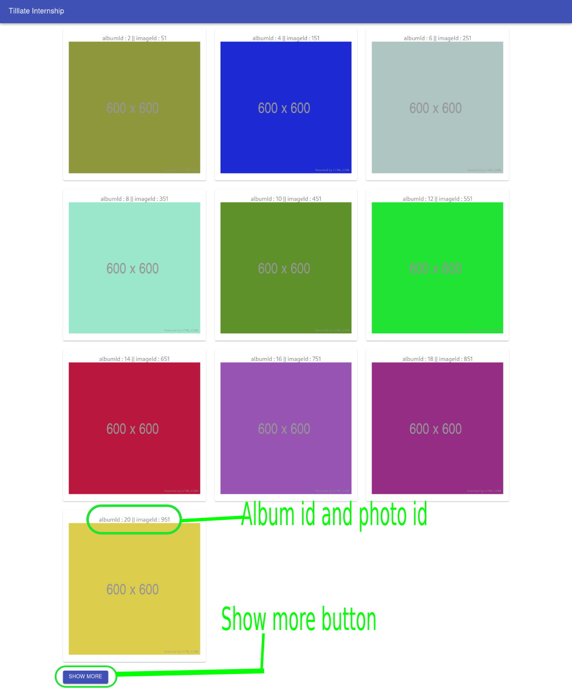

# tilllate internship project :

----------

### Overview :

this project is a simple image gallery of imgs provided from json.placeholder API, with simple requirment which is take the 1st img only from every album with an even id.show just 10 imgs, add load more button to load more 10, using Material ui, axios "to fetch the api" and so more fun and custom functionality along with react's ones.

----------

### Satisfied requirements :

- ~~set up react project~~
- ~~use Material UI Framework for the UI components~~
- ~~create image gallery~~
- ~~use: https://jsonplaceholder.typicode.com/photos API to get images for gallery~~
- ~~Make the gallery responsive so that in Desktop it will show 3 items per row, 2 in table and 1 on small devices~~
- ~~Only take the 1st image of each album with an even ID, so i end up with 50 image as required~~
- ~~The album should only show the first 10 pictures, and a Show More button should allow to show 10 more, and so on up to 50~~

----------

### Walk through :

- Installation :
  - install react
  - install Material ui
  - install axios

- Design :
    - create ButtonAppBar component (simple nav bar) using material ui, import it in App
    - used Container{lg}, Grid for responsive design (gallery grid 3 2 1)
    - used Paper to show image
    - Button for Show more button
    - used makeStyles hook to create css styles

- Logic :
    - fetch images from api (using axios), once the component did mount (using useEffect hook)
    - filtring images to get images with even albumId only ( .filter())
    - group images with the same albumId (used custom reducer func : " groupByAlbumId() ")
    - take the 1st image from each album with even id, by looping around the grouped albums i created before than take the 1st image from each album
    - slice images by 'visileImages state' (default 10) to render only 10 at the first render.
    - Show More button allow to show 10 more, and so on up to 50 (not visible if visible imgs < 50, and isLoading === false)

----------

##### Unsatisfied requirements :
- using TypeScript

----------

##### Preview :

